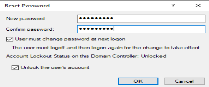

# 🔑 Reset AD User Password – SOP

**Purpose:**  
This SOP describes the process of securely resetting an Active Directory user password while ensuring compliance with company security policies.

---

## **Scope**
For IT Support staff with password reset privileges in ADUC or RSAT.

---

## **Prerequisites**
- Access to ADUC or RSAT tools
- Permission to reset passwords
- Verified user identity

---

## **Procedure**
1. **Verify User Identity**
   - Confirm details via security questions or ticket system.
   - Ensure the request is legitimate (e.g., no phishing attempt).

2. **Open Active Directory Users and Computers (ADUC)**
   - Press `Windows + R` → Type `dsa.msc` → Press **Enter**.
   - Navigate to the user’s Organizational Unit (OU).

3. **Locate the User**
   - Search for the username.
   - Right-click the account → Select **Reset Password**.

4. **Enter the New Password**
   - Use a secure temporary password (e.g., `Temp!Pass1234`).
   - Check **User must change password at next logon**.

5. **Communicate Securely**
   - Provide the temporary password verbally or via secure channel.
   - Never send passwords in plain text email.

---

## **Sample Screenshot**
Here’s an example screenshot showing the **Reset Password** dialog in ADUC:  

---

## **Security Considerations**
- Do not reuse previous passwords.
- Report suspicious password reset requests to the security team.
- Log all password resets in the ticketing system.
